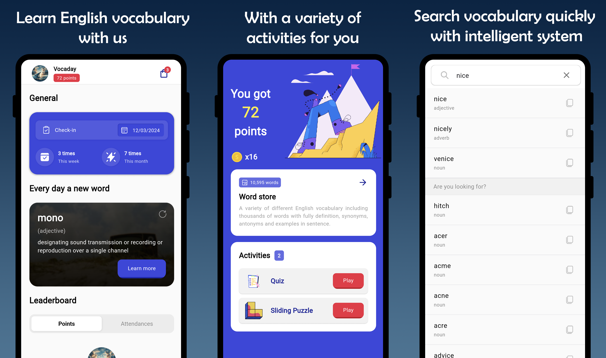
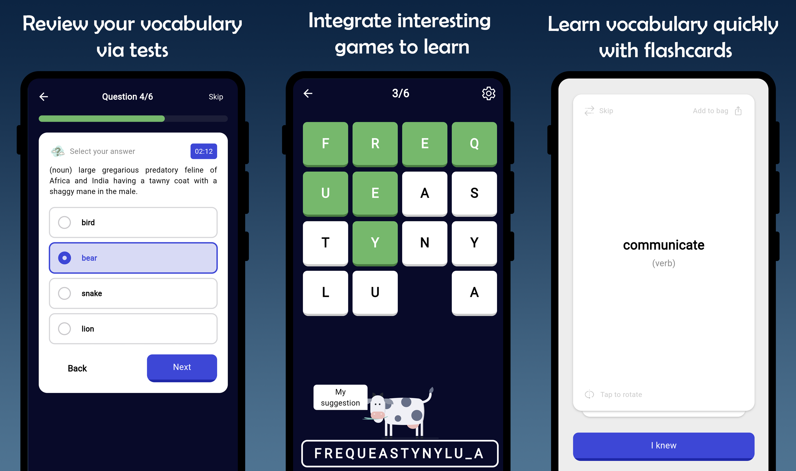
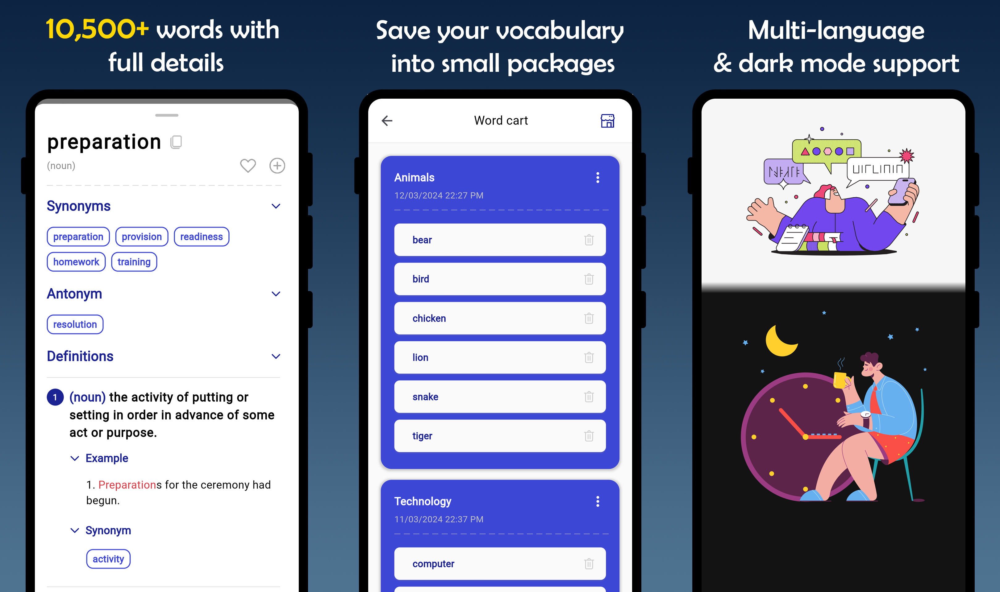

# Vocaday: English vocabulary app

📚 Welcome to Vocaday, your go-to English vocabulary learning app! 🌟

**Vocaday** is designed to make your English vocabulary learning experience **effective and enjoyable**. Whether you're a beginner or looking to enhance your language skills, Vocaday has got you covered.

To quickly view the user interface: [link](https://github.com/helkaloic/vocaday_app?tab=readme-ov-file#-user-interface)


<p align="center">
  <a href="https://github.com/helkaloic/vocaday_app/stargazers">
     
  </a>
  <a href="https://github.com/helkaloic/vocaday_app/network/members">
    
  </a>
  <a href="https://github.com/helkaloic/vocaday_app/watchers">
    
  </a>
</p>

## ⬇️ Download

- Download `apk` file for ``Android`` 👉 [Download Latest Release APK](https://github.com/helkaloic/vocaday_app/releases/latest)

- Download from `Google Play Store`

<a href="https://play.google.com/store/apps/details?id=com.vocaday.vocaday_app">
  
</a>

## 📂 Folder Structure

Here's a simple folder structure of this project.

> _**Note**: it may has more folders and files in there_

<details>

<summary>Click to expand</summary>

```plaintext
vocaday_app/
|-- assets/    # includes all asset or resource files
|-- lib/
|   |-- app/    # main 'things' in the app, will be changed dynamically
|   |-- core/    # core interface or other base things
|   |-- config/    # configs for the whole app
|   |-- features/    # the main features in the app, it should be independent on each other
|   |   |-- feature-1/
|   |   |   |-- data/
|   |   |   |   |-- data_sources/    # local or remote data call
|   |   |   |   |-- models/          # model for mapping json data
|   |   |   |   |-- repositories/    # implement interface of repositories in 'domain'
|   |   |   |-- domain/
|   |   |   |   |-- repositories/    # main function to handle result from 'data_source' and catch Exception then throw Failure
|   |   |   |   |-- entities/        # entity that be used in the app
|   |   |   |   |-- usecases/        # the usecase for each requirements
|   |   |   |-- presentation/
|   |   |   |   |-- blocs/           # state management
|   |   |   |   |-- pages/           # includes concrete screen of this feature
|   |   |   |   |-- widgets/         # includes local widget of this feature
|   |   |-- feature-2/
|   |   |-- ...
|   |-- app.dart    # whole app endpoint, for setup
|   |   ...
|   |-- main.dart
|-- test/    # to test (currently unit test)
|-- pubspec.yaml
```

</details>

## 🔗 Resource

Here's some sources for `assets` folder.

- `data` [English Dictionary Data](https://github.com/helkaloic/english-dictionary-data)
- `fonts` [Google Fonts - Roboto](https://fonts.google.com/specimen/Roboto)
- `icons` & `images` Icons from [Lunacy](https://icons8.com/lunacy)
- `jsons` [Lotties](https://lottiefiles.com/)
- `translations` created with the support of [i18n Manager](https://github.com/gilmarsquinelato/i18n-manager)

## ⚙️ Setup

Get started with Vocaday by following these simple steps:

1. **Install FlutterFire CLI & Firebase:**

   - Install [FlutterFire CLI](https://firebase.flutter.dev/docs/cli/)

   - Add Firebase to your Flutter app via this [link](https://firebase.google.com/docs/flutter/setup)

1. **Clean and Get Dependencies:**
    ```bash
    flutter clean
    flutter pub get
    ```

2. **Run the App:**
    ```bash
    flutter run
    ```

3. **(Optional) to build `.apk` file:**
    ```bash
    flutter build apk
    ```


## 🪲 Debug/Release

Generate `debug.keystore`:

```
keytool -genkey -v -keystore "android\app\debug.keystore" -storepass android -keypass android -keyalg RSA -keysize 2048 -validity 10000 -alias androiddebugkey -dname "CN=Android Debug,O=Android,C=US"
```

Get `SHA-1` or `SHA-256` fingerprint:

```
keytool -list -v -keystore "android\app\debug.keystore" -alias androiddebugkey -storepass android -keypass android
```

If Google Sign In did not work, try to run these commands:

```
cd android
./gradlew signingReport
```

Then use the `SHA-1/SHA-256` with tag **'Config: debug'** to update fingerprints on your Firebase project.

## 💻 Code Generation

- ### Easy_localization:

    If you make any changes from any translation files. To update the new changes, run those commands below in order:

1. Generate Loader class:

    ```bash
    dart run easy_localization:generate -S "assets/translations" -O "lib/app/translations"
    ```

2. Generate Keys class:
    ```bash
    dart run easy_localization:generate -S "assets/translations" -O "lib/app/translations" -o "locale_keys.g.dart" -f keys -u true
    ```

    For detailed information, refer to the [easy_localization documentation](https://pub.dev/packages/easy_localization#-code-generation).

    | Arguments | Short | Default | Description |
    | --------- | ----- | ------- | ----------- |
    | --help    | -h    |         | Help info   |
    | --source-dir | -S | resources/langs | Folder containing localization files |
    | --source-file | -s | First file | File to use for localization |
    | --output-dir | -O | lib/generated | Output folder stores for the generated file |
    | --output-file | -o | codegen_loader.g.dart | Output file name |
    | --format | -f | json | Support json or keys formats |
    | --[no-]skip-unnecessary-keys | -u  | false | Ignores keys defining nested object except for plural(), gender() keywords |

- ### Flutter Gen:

    If you add any files to the `assets` folder, then you would need to add its path to the generated class (to avoid hard-code), run those commands below in order:

   Activate [flutter_gen](https://pub.dev/packages/flutter_gen) (only once):

   ```bash
   dart pub global activate flutter_gen
    ```

1. Run build_runner:

    ```bash
    dart run build_runner build --delete-conflicting-outputs
    ```

2. Generate Assets:
    ```bash
    fluttergen -c pubspec.yaml
    ```

## ⛄️ FAQs

1. **Q: How to fix "Gradle sync failed: Could not create task..." error when opening project with Android Studio?**

    **A:** Delete **.gradle** & **.build** folders inside **android** folder, then run those command below in order:

    ``` bash
    flutter clean
    flutter pub get
    ```

    Right-click on the `android` folder and select `Open in Android Studio`.

    ``` bash
    flutter clean
    flutter pub cache repair
    ```

    After that, select `File` -> `Invalidate Caches...` -> ✓ Check all -> `Invalidate and Restart`.

## 👀 User Interface

Vocaday currently offers a clean and intuitive user interface with these main pages:

1. **Main Page (Home, Activity, Search):**



2. **Learning Page (Quiz, Puzzle, Flashcard):**



3. **Word Page (Detail, Wordbag, Setting):**



## Visitors


